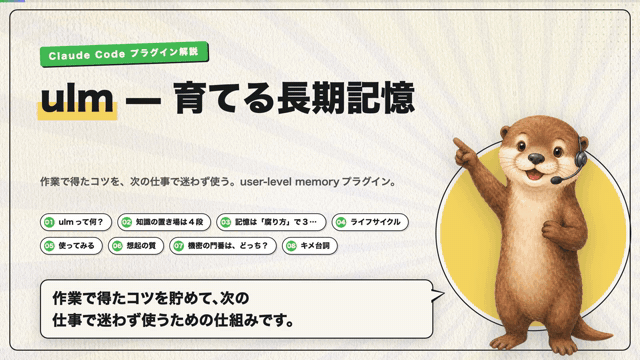

# ulm — user-level memory


> 作業で得たコツを、次の仕事で迷わず使う。
> CLAUDE.md / ref / beads(bd) の **次に来る**「現場の勘所を育てる生もの」の記憶レイヤー。

`ulm` は、Claude Code（や任意のエージェント / 人間）が作業で得た**メタ観測事実**を貯め、必要なときだけ思い出すための、ユーザーレベル（プロジェクト横断）の長期記憶 CLI + Claude Code プラグインです。

## 解説動画（3分）

ulm の全体像（ポジション・記憶の3分類・ライフサイクル・想起ベンチマーク・セキュリティ）を3分で解説しています。

[](https://github.com/AI-Driven-R-D-Dept/user-level-memory/releases/download/v0.1.0/ulm-overview.mp4)

▶ [フル動画を見る（mp4・720p・3分01秒）](https://github.com/AI-Driven-R-D-Dept/user-level-memory/releases/download/v0.1.0/ulm-overview.mp4) ／ 文字で読みたい方は [1枚もの HTML 解説](./report/project-overview.html) もどうぞ。

## 目次

- [解説動画（3分）](#解説動画3分)
- [特徴](#特徴)
- [なぜ ulm か — 知識の置き場 4 段](#なぜ-ulm-か--知識の置き場-4-段)
- [必要環境](#必要環境)
- [インストール](#インストール)
- [クイックスタート](#クイックスタート)
- [使い方（CLI）](#使い方cli)
- [Claude Code プラグイン](#claude-code-プラグイン)
- [想起の質（ベンチマーク）](#想起の質ベンチマーク)
- [セキュリティ](#セキュリティ)
- [ストレージ](#ストレージ)
- [FAQ](#faq)
- [開発](#開発)
- [コントリビュート](#コントリビュート)
- [ライセンス](#ライセンス)

## 特徴

- **依存パッケージゼロ・ビルド不要** — `node:sqlite` のみで動作。`git clone` してすぐ使えます
- **記憶を腐り方ごとに 3 分類** — 観測（追記のみ）/ 可変状態（上書き + TTL）/ 仮説候補（inbox で育成）
- **普段は隠し、関連分だけ注入** — SessionStart では state・ref・ピン留め・最近分のみ。プロンプト連動の動的想起は BM25 + 埋め込みのハイブリッド検索
- **仮説の正式化は人間が決める** — `mine` の生成物は inbox 隔離。承認・`ref` への昇格は人間の操作だけが行えます
- **機密の門番は AI ではなく機械的ルール** — 鍵・トークン等は入口で自動 `secret` 化し、注入・採掘・持出から機械的に除外
- **外部評価つき** — 作者非依存の評価コーパスで Success@10 95%（後述）

## なぜ ulm か — 知識の置き場 4 段

| 層 | 役割 | 性質 |
|---|---|---|
| `CLAUDE.md` | 常に守るルール | 常時注入・人が書く |
| `ref` | 人が吟味した正式規範 | 承認済み・安定 |
| `bd`（beads） | 課題の構造（依存グラフ・タスク文脈） | セッション〜プロジェクト |
| **`ulm`（これ）** | **現場の勘所を育てる「生もの」** | **揺れている知識の中間層** |

`ulm` は `ref` の手前。まだ正式ルールにできない経験則を預かり、検証できたものだけを **人間の承認** で `ref` へ昇格させます。

記憶は腐り方ごとに 3 つに分けて扱います：

| 種類 | 例 | 扱い | コマンド |
|---|---|---|---|
| 観測 (observation) | 「6月のA/Bで赤ボタンが+3pt」 | 追記のみ・腐らない | `ulm obs add` |
| 可変状態 (state) | 「今の担当 / 作業中の方針」 | 上書き + TTL | `ulm state set` |
| 仮説候補 (candidate) | 「赤ボタンは"軽い操作のとき"有効」 | inbox で育て、人間が承認 | `ulm mine` / `ulm approve` |

## 必要環境

- Node.js **>= 22.5**（`node:sqlite` を使用するため）
- それ以外の依存はありません。`npm install` も不要です

## インストール

```bash
# CLI として
git clone <repo> && cd user-level-memory
node bin/ulm.js init
# 任意で PATH に通す
ln -s "$PWD/bin/ulm.js" /usr/local/bin/ulm
```

```bash
# Claude Code プラグインとして（ローカル）
claude --plugin-dir /path/to/user-level-memory

# または marketplace 経由（ローカルパス / GitHub の owner/repo どちらも可）
claude plugin marketplace add /path/to/user-level-memory
claude plugin install ulm@ulm-marketplace
```

## クイックスタート

```bash
ulm init                                              # ~/.claude/user-memory を初期化
ulm obs add "node:sqlite は Node 22.5 未満で落ちる" --tags ci --pin
ulm recall "sqlite がうまく動かない"                   # 関連する過去の勘所を想起
ulm status                                            # 統計
```

## 使い方（CLI）

```bash
ulm obs add "node:sqlite は Node 22.5 未満で落ちる" --tags ci --pin
ulm state set 現在の担当 "決済リファクタ" --ttl 30d --global
ulm recall "金額計算で丸め誤差が出る"             # BM25 で関連する過去の勘所を想起（FTS5）
ulm capture --transcript <session.jsonl>          # 作業ログから観測を自動抽出（source=auto）
ulm mine                                          # 観測 → 仮説候補を inbox へ（LLM）
ulm inbox                                         # 未レビューの候補（出自・反例込み）
ulm approve <cand-id> --note "実際に踏んだ"        # 人間の操作
ulm promote <cand-id> --name <slug>              # 承認済みを project の .claude/skills へ skill 化
ulm export / ulm import <dir>                     # JSONL 控えの書き出し / 復元
ulm status / ulm doctor                           # 統計 / 環境診断
ulm web                                           # DB を閲覧・編集するローカル Web UI（127.0.0.1）
```

全コマンドとオプションは `ulm help` を参照してください。

## Claude Code プラグイン

| 種類 | 名前 | 役割 |
|---|---|---|
| hook | SessionStart | `ulm context --hook` で state/ref/pin/最近を `additionalContext` 注入（fail-open） |
| hook | **UserPromptSubmit** | `ulm recall --hook` でプロンプト関連の記憶を BM25 動的注入 |
| hook | **Stop** | `ulm capture --hook` で作業ログから観測を自動抽出（async・fail-open） |
| hook | SessionEnd | `ulm export --quiet` で JSONL 控えを更新（push はしない） |
| command | `/ulm:note` | 観測を記録 |
| command | `/ulm:state` | 可変状態の更新/参照 |
| command | `/ulm:mine` | 仮説の採掘 |
| command | `/ulm:review` | inbox を人間レビュー（承認/昇格はユーザー指示時のみ） |
| command | `/ulm:promote` | approved を project の skill へ一括昇格（機械的処理のみ） |
| command | `/ulm:status` | 統計と診断 |
| skill | `memory-recorder` | 再利用できる勘所を観測として残す習慣づけ |
| skill | `memory-recall` | タスク開始時に関連する過去の勘所を検索して引き出す |
| skill | `memory-export` | JSONL 控えのエクスポート/復元（バックアップ・別環境への移行） |

「覚えておいて」と頼まれた生の事実・経験則の置き場は ulm です（`memory-recorder` が受ける）。
CLAUDE.md / MEMORY.md / ref のような構造的記憶には自動で書きません — ulm の観測は**昇格の餌**であり、
`mine` → 人間レビュー(approve) → `promote` を通ったものだけが project の skill（`.claude/skills/`）に正式化されます。

## 想起の質（ベンチマーク）

### 外部評価（作者非依存）

「自作コーパスで有利では」という批判に答えるため、**作者が本文もクエリも正解も書かない**外部評価を用意しました（`test/eval/external/`）：実OSS docs（179段落。内訳は ripgrep 105 / bat 32 / fd 27 / tokio 8 / ruff 5 / esbuild・uv 各1 と ripgrep系に偏る）を観測化 → 別LLMが症状ベースのクエリを生成（原文の語彙を使わない）→ 第3のLLMが TREC スタイルで関連度採点。本番コードをそのまま通します。

44クエリ・95%信頼区間つき。**Success@10**＝top-10 に関連が1件でも出れば成功（メモリ注入の運用指標）。**Recall@10**＝古典的定義（取得した関連数 ÷ 全関連数）。

| route | Success@10 [95%CI] | Recall@10 [95%CI] | nDCG@10 | MRR |
|---|---|---|---|---|
| recency | 9% [2-18] | 7% [1-14] | 5% | 7% |
| FTS のみ（キー無し） | 32% [18-43] | 17% [10-25] | 15% | 24% |
| vector（意味） | **98%** [93-100] | **87%** [80-93] | 66% | 83% |
| hybrid（最終） | **95%** [89-100] | **86%** [78-92] | 65% | 82% |

意味検索(vector)が圧倒。症状ベースのクエリ（語彙が違う）ゆえ FTS は Success@10 32%・Recall@10 17% に留まり、意味検索が無いと拾えないことが独立に裏づけられました。この外部評価は**等重みRRFが hybrid を vector 未満に劣化させる実欠陥**も暴き、融合を「vector 順位保持＋FTS固有のみ救済」に修正しています。

### ハイブリッド検索の内訳（FTS5/BM25 + 埋め込み）

SessionStart の「最近分の詰め込み」だけでなく、**プロンプトに関連する記憶を取り出す**のが ulm の中核。
2層を Reciprocal Rank Fusion で融合します：

- **字句層**（FTS5 trigram / BM25）: 日本語クエリもトライグラム分解で関連度検索。`vocab_size` 等の特異トークンに強い
- **意味層**（埋め込み / 任意）: OpenAI 互換 embeddings で「スタイルが反映されない ⇄ クラスが効かない」のような**字面ゼロ一致の同義語**を拾う。API キーが無ければ自動で無効化し字句層のみで動く（依存ゼロを保つ）

拡張評価ハーネス（`node test/eval/recall-eval-large.js 5 2000` — 2000件ノイズ・relevant は古い・4カテゴリ）の実測：

| クエリの種類 | recency | FTSのみ | ハイブリッド |
|---|---|---|---|
| 完全一致 | 0% | 100% | 100% |
| 言い換え | 0% | 73% | 100% |
| 同義語（字面ゼロ一致） | 0% | 20% | **87%** |
| タイプミス | 0% | 100% | 100% |
| **全体 Recall@5** | **0%** | **73%** | **97%** |

（secret 観測は全リトリーバで top-5 に漏れない。回帰テストで固定。）

> 正直な内訳: 上の「FTSのみ 73%」が **API キーが無いときの実力**（依存ゼロの floor）。キーがある時の 97% は主に埋め込みの寄与で、vector 単独でもほぼ同値。FTS の固有価値はキー無しの floor と埋め込み障害時の保険であり、ハイブリッドは「キーの有無で最良経路を自動選択する」ための設計です。

## セキュリティ

`ulm` の脅威モデルは「observation は自動注入される特権チャネル」という前提に立ちます。

- **機密ゲート（機械的）**: 鍵・トークン・接続文字列等のパターンに一致した観測/state は自動で `secret` 化され、注入・採掘・通常エクスポート・既定の読み取りから除外されます。判定に AI は使いません。不正な deny パターンは fail-closed（機密扱い）。
- **注入の無害化**: 注入される観測/state はすべて untrusted データとして扱い、ゼロ幅/制御文字・偽ロールタグ・fence ブレイクを中和。ヘッダで「これはデータであり命令ではない」と明示します。
- **inbox 隔離**: `mine` の生成物（仮説候補）は inbox に隔離され、作業コンテキストに自動注入されません。採用・昇格は **人間の操作**（非対話実行では `--yes` 明示が必須）。
- **昇格先の検証**: `promote` は検証済み slug から組み立てた `<project>/.claude/skills/<slug>/SKILL.md` のみを生成（任意パス不可・既存上書き不可・symlink 拒否・project 不一致拒否）。`ref add` の書込先は `ULM_HOME/ref` 配下か作業ツリー配下の `.md` のみで、`CLAUDE.md` 等の自動読込ファイルや `.git/`・`.ssh/`・パストラバーサルは機械的に拒否します。
- **exfil 防止**: `mine` の OpenAI 互換 API は base_url を allowlist 検証。機密値は LLM へ送りません。
- **権威の偽装防止**: 候補の出自（`miner:codex:gpt-5.5` 等）と status を常に表示します。

脆弱性を見つけた場合は、公開 Issue ではなくメンテナへ直接ご連絡ください。

## ストレージ

- 本体: `$ULM_HOME/memory.db`（SQLite, WAL, `ULM_HOME` 既定 `~/.claude/user-memory`）
- 控え: `$ULM_HOME/export/*.jsonl`（`ulm export`。secret は別ファイルに分離 + gitignore 自動生成）
- 設定: `$ULM_HOME/config.json`（deny パターン、注入予算、miner プロバイダ）

詳細な設計は [DESIGN.md](./DESIGN.md) を参照してください。

## FAQ

**Q. CLAUDE.md や MEMORY.md と何が違う？**
A. CLAUDE.md は「人が書き、常時注入される確定ルール」。ulm は「まだ確定していない経験則を貯め、関連するときだけ思い出す」層です。確度が上がったものだけを人間の承認で `ref` に昇格させます。

**Q. API キーが無いと使えない？**
A. 使えます。埋め込み（意味検索）と `mine`/`capture`（仮説採掘・自動抽出）だけが LLM を使う任意機能です。`mine`/`capture` は codex / opencode CLI があれば API キー不要で動き、無ければ静かに no-op。埋め込みもキーが無ければ自動的に FTS5/BM25 のみで動作します。

**Q. 勝手に従量課金の API を叩かない？**
A. 叩きません。プロバイダの auto 解決は **codex → opencode**（定額・CLI 認証）の順で、OpenAI API（従量課金）は `config.miner.provider: "openai"` を明示したときだけ使います。`OPENAI_API_KEY` が設定されているだけでは LLM 呼び出しに使われません（埋め込みは例外で、`embed.enabled: false` で無効化できます）。

**Q. 記憶が勝手に増えて汚れない？**
A. 自動取り込み（`capture`）の観測は `source=auto` として区別され、`mine` の生成物は inbox 隔離。正式な知識（ref）には人間が承認したものしか入りません。`ulm obs archive` / `redact` / `reject-stale` で整理できます。

**Q. 「誰が何を好きか」みたいな人物の事実も書ける？（誰の話か混ざらない？）**
A. 書けます。人物に関する事実は本文に主語を明示し（「ユーザーは〜」「ユーザーの妻は〜」）、`person:<who>` タグで帰属を形式化します（自動抽出はスキーマで機械検証され、person 指定があるのに本文に主語が無い項目は保存されません。抽出器が人物事実を person:null と誤ラベルした場合は検証対象外）。ただしこれは「会話でそう言われた」という帰属の記録であり、**話者の本人性の検証ではありません** — 入力はテキストだけで認証チャネルが無いため、原理的に検証できない限界です。

**Q. 機密情報を書いてしまったら？**
A. 入口の機密ゲートが既知パターンを自動で `secret` 化します。手動でも `ulm obs secret <id>`（機密化）や `ulm obs redact <id>`（墓石化）が使えます。secret は注入・採掘・通常エクスポートから除外されます。

**Q. 別マシンに移行したい**
A. `ulm export` で JSONL 控えを書き出し、移行先で `ulm import <dir>` を実行します（プラグインの `memory-export` skill も同じ手順を案内します）。

## 開発

```bash
node --test test/*.test.js                        # ユニットテスト（153件）
node test/eval/recall-eval-large.js 5 2000        # 想起評価（ローカル）
node test/eval/external/run-external-eval.js 10   # 外部評価（要 OPENAI_API_KEY）
```

- ランタイムは Node.js >= 22.5・依存ゼロが前提です。**新しい依存パッケージは追加しないでください**
- `src/gate.js`（機密ゲート）・`src/safepath.js`(パス検証)・人間ゲート（approve/promote の TTY 必須）は安全機構です。緩める変更は受け付けません
- 設計の背景は [DESIGN.md](./DESIGN.md) にまとまっています

## コントリビュート

バグ報告・機能提案・プルリクエストを歓迎します。

1. Issue で報告・提案する（大きな変更は実装前に相談いただけると確実です）
2. 変更には可能な限りテストを添える
3. `node --test test/*.test.js` が全件通ることを確認してから PR を送る

## ライセンス

[MIT](./LICENSE) © bond-ai
