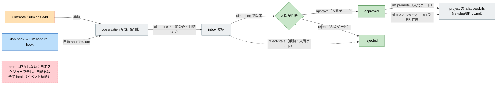
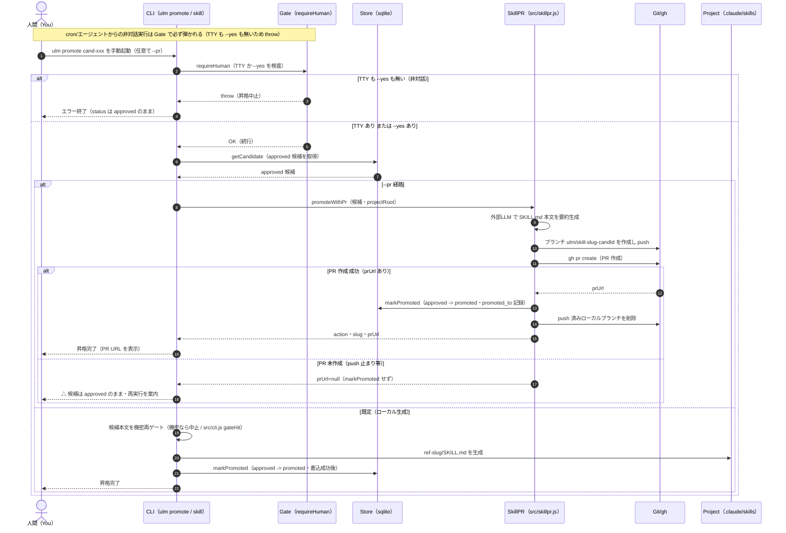
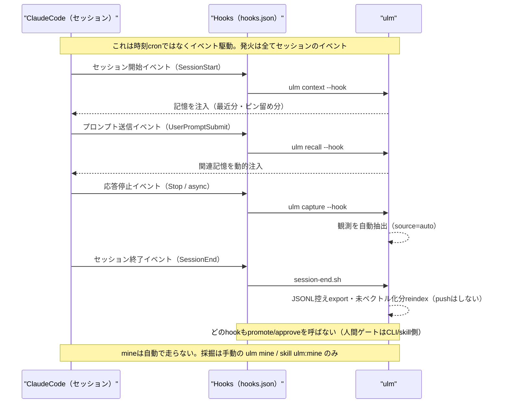
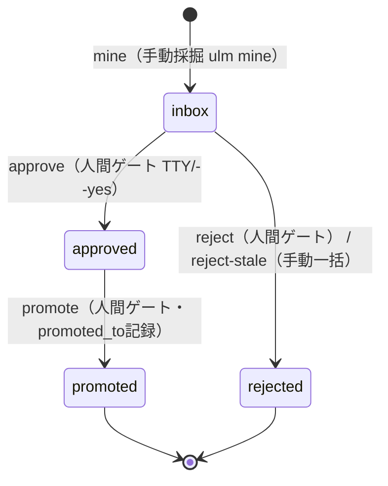

# ulm 使い方ガイド — 記憶のライフサイクルと昇格フロー

> 「観測（生もの）」が「project の正式な skill」に育つまでの流れと、その各段で**誰が・何で**起動するのかを図で示すガイドです。
> インストールや全コマンドの早見は [README](../README.md) を参照してください。

## 結論（先に要点）

- **昇格フローは人間が一段ずつ進める手動操作です。** 候補は `inbox → approved → promoted` と進みますが、`approved` への昇格（`approve`）も `promoted` への昇格（`promote`）も、人間が明示的に叩いたときだけ動きます。
- **`promote` は cron ではありません。** 定期実行・自動昇格の仕組みは実装に存在しません。`promote` の唯一の入口は `requireHuman()` を無条件に通り、TTY か `--yes` が無ければ中止します。
- **「自動で動く」の正体は cron ではなく、Claude Code の hook（イベント駆動）です。** セッションの開始/送信/停止/終了で発火し、観測の注入・想起・自動抽出を行います。どの hook も `promote`/`approve` は呼びません。

---

## 1. 記憶のライフサイクル全体像

観測（observation）が project の skill に昇格するまでの全体像です。エッジの注記が「何で起動するか」を表します。

**トリガ種別の凡例**

| 色 | 種別 | 意味 |
|---|---|---|
| 🟧 橙 | 手動 CLI | `ulm obs add` など、人間が CLI を叩く |
| 🟦 青 | 自動 hook | Claude Code のイベントで発火（cron ではない） |
| 🟩 緑 | 人間ゲート | `approve`/`promote`/`reject-stale`（TTY か `--yes` 必須） |
| ⬜ 灰 | 状態ノード | observation / inbox / skills などのデータ |
| 🟥 赤(破線) | cron | **存在しない**（自走スケジューラは無い） |

---

## 2. 各段階の説明

| 段階 | 起動 | 何が起きるか |
|---|---|---|
| **observation 記録** | 手動 `/ulm:note`・`ulm obs add` / 自動 `Stop` hook → `ulm capture --hook` | 作業で得たメタ観測事実を追記。自動抽出分は `source=auto` で区別。 |
| **mine（採掘）** | **手動のみ** `ulm mine` / skill `ulm:mine` | 観測群から仮説（クラフト規範）候補を生成し `inbox` へ。自動実行されない（`Stop` hook は `capture` を呼ぶだけ）。 |
| **inbox** | — | 生成された候補の初期状態。作業コンテキストには自動注入されない（隔離）。 |
| **review** | 手動 `ulm inbox` / skill `/ulm:review` | inbox 候補を人間に提示。出自・反例つき。採否の判断は人間。 |
| **approve / reject** | 手動・人間ゲート（TTY か `--yes`） | `inbox → approved` または `inbox → rejected`。 |
| **promote（昇格）** | 手動・人間ゲート | `approved → promoted`。project の `.claude/skills/ref-<slug>/SKILL.md` を生成（`--pr` 経路は PR 作成）。 |

---

## 3. promote（昇格）の流れと「cron なの？」

`approved` の候補を project の skill へ昇格する最重要操作です。唯一の入口 `cmdPromote` は `requireHuman()` を無条件に呼ぶため、**スケジューラやエージェントからの非対話・非明示の実行は構造的に弾かれます**。

**Q. `promote` は cron / スケジューラで自動的に走っていますか？**
いいえ。リポジトリ全体を `cron / launchd / systemd / setInterval / crontab` で検索してもスケジューラ機構はヒットしません（`setTimeout` は HTTP リクエストの abort タイムアウト、`expires_at` は読み取り時の TTL 無視であって、いずれも能動的に時刻で発火しません）。

**Q. では「自動で動く」と聞いたのは？**
Claude Code の **イベント駆動 hook**（次節）です。時刻スケジューラではありません。

**Q. `reject-stale` は名前に auto が付くけど自動却下では？**
`ulm reject-stale [--days 90]` は古い `inbox` 候補を一括 `rejected` にしますが、**人間が手で叩いたときだけ**動く手動コマンド（人間ゲート必須）です。タイマーで自走しません。

---

## 4. 自動化の実体 ＝ イベント駆動 hook

ulm の「自動」は cron ではなく、`hooks/hooks.json` に定義された 4 つの Claude Code hook（セッションのイベントで発火）です。

> hook の `timeout` 値（例: `Stop` の 150 秒）は実行時間の上限であって、周期ではありません。

---

## 5. 候補（candidate）の状態遷移

候補の `status` は `inbox / approved / promoted / rejected` の 4 値のみです。

---

## 6. 各段階の実コマンド / skill 早見表

| 段階 | CLI | skill（プラグイン） | 起動トリガ | 状態変化 |
|---|---|---|---|---|
| 記録 | `ulm obs add` | `/ulm:note`・`memory-recorder` | 手動 | （観測の追記） |
| 記録（自動） | `ulm capture --hook` | — | `Stop` hook（自動） | （`source=auto` 観測） |
| 採掘 | `ulm mine` | `/ulm:mine` | 手動のみ | → `inbox` |
| レビュー | `ulm inbox` | `/ulm:review` | 手動 | （提示のみ） |
| 承認 | `ulm approve <id>` | （review 内で人間指示） | 手動・人間ゲート | `inbox → approved` |
| 却下 | `ulm reject <id>` / `ulm reject-stale` | — | 手動・人間ゲート | `inbox → rejected` |
| 昇格 | `ulm promote <id> [--name <slug>]` | `/ulm:promote` | 手動・人間ゲート | `approved → promoted` |
| 昇格（PR） | `ulm promote <id> --pr [--yes]` | — | 手動・人間ゲート | PR 成功時のみ `promoted` |
| 想起 | `ulm recall "<query>"` | `memory-recall` | 手動 / `UserPromptSubmit` hook | （読み取り） |

---

## 7. 3 層の安全機構

ulm は「observation は SessionStart で自動注入される特権チャネル」という脅威モデルに立ち、3 層で守ります。

1. **機密ゲート（`src/gate.js`）** — 鍵・トークン・接続文字列等を入口で機械的に `secret` 化し、注入・採掘・通常エクスポートから除外。判定に AI は使わない。
2. **パス検証（`src/safepath.js`）** — 昇格 skill の書込先を機械検証（`ref-` 名前空間必須・symlink 拒否・既定は新規生成のみ・`--pr` は実在 slug 限定）。
3. **人間ゲート（`requireHuman`）** — `approve` / `promote` / `reject-stale` は TTY か `--yes` が必須。非対話・非明示の自動実行を弾く。

---

## 8. Web UI（`ulm web`）と「なぜ昇格が見えにくいか」

`ulm web` は `127.0.0.1` にローカル UI を立て、観測・候補を閲覧/編集できます（起動ごとのランダム token 必須）。

ただし **UI に `promote` の動線はありません**。これは責務分離による意図的な設計で、昇格は人間ゲートが必要なため入口を CLI / skill 側だけに置いています。結果として UI 上ではフローが `approved` で途切れて見え、これが「昇格フローが見えにくい」と感じる原因です。昇格は CLI（`ulm promote`）または skill（`ulm:promote`）で行ってください。

---

*オフラインで開ける 1 枚もの HTML 版もあります: [`report/ulm-usage-guide.html`](../report/ulm-usage-guide.html)（Mermaid をインライン同梱・ネットワーク依存ゼロ）。*
